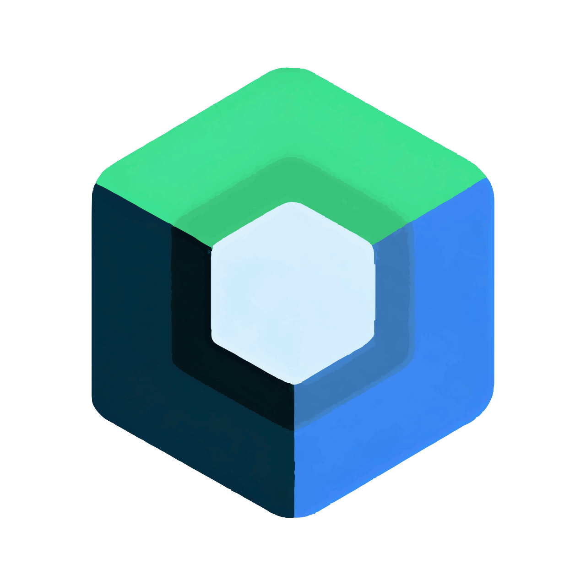

# Hi, I'm Shiva Thapa! 👋

Welcome to my GitHub profile! I'm a passionate developer always eager to learn and build amazing projects.

For me, the real excitement lies in the dance of keys. ⌨️

## 🚀 About Me

- 🔭 I’m currently working on Android projects
- 🌱 I’m currently learning Kotlin Multiplatform
- 👯 I’m looking to collaborate on Android applications
- 💬 Ask me about Android, Web, Books, and Technology
- ⚡ Fun fact:   When fingers dance on keys, I code with all my might,   But when a pen is in my hand, I craft verses through the night.

## 🛠️ Skills

## 📫 Connect With Me

<!--

-->

## 📝 Latest Blog Posts

<!-- BLOG-POST-LIST:START -->

<!-- BLOG-POST-LIST:END -->

## 🌟 Explore

## 📈 GitHub Stats

<table align="start">
  <tr>
    <td>
    
    </td>
    <td>
      
    </td>
  </tr>
</table>

## 🔝 My Contributions

<table align="start">
  <tr>
    <td>
    
    </td>
    <td>
      
    </td>
  </tr>
</table>

<!--
## 🏆 GitHub Trophies

-->

## ✍️ Learn from quotes, laugh at memes. 😂

   &emsp;&emsp;
  

 
 
 

> Smile is the only thing that lets you see the World smiling back. So smile wide! 😃

---

<!--

-->

Thank you for visiting my profile! Feel free to explore my repositories and get in touch if you want to collaborate on any project.

